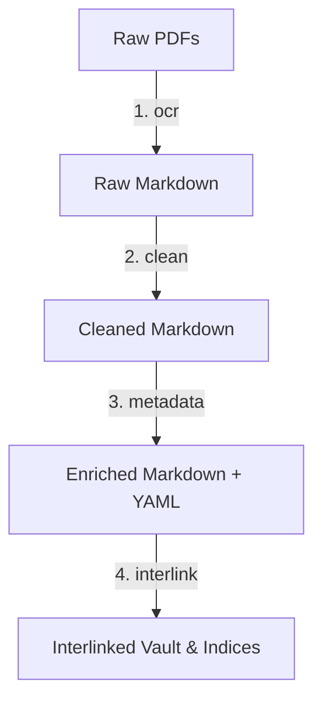

# Welcome to the OCRPolish Archive

## Project Overview
**ocrpolish** is a specialized toolkit for cleaning, formatting, and validating OCR outputs processed by Large Language Models (LLMs) and Vision-Language Models (VLMs). This vault serves as a structured, searchable, and interlinked archive of processed historical documents.

- **GitHub Repository:** [honzas83/ocrpolish](https://github.com/honzas83/ocrpolish)
- **Toolkit Documentation:** [README.md](https://github.com/honzas83/ocrpolish/blob/main/README.md)

---

## The Document Pipeline
The workflow transforms raw historical document scans (PDFs) into an enriched, cross-linked Obsidian vault:



### 1. VLM-based OCR (`ocr` command)
Converts multi-page PDFs to Markdown using a local VLM (e.g., `qwen3.5:9b`).
- Handles complex layouts, handwriting, and tables.
- Employs **context-aware page processing** where context from the preceding page is passed forward to improve transcription.
- Features **page-level resume safety**, allowing interruptions to be resumed page-by-page without repeating already transcribed pages.

### 2. Post-OCR Clean & Wrap (`clean` command)
Polishes raw markdown output:
- Standardizes paragraph line-wrapping (default: 80 characters).
- Sanitizes text and strips repetitive headers, footers, or page numbers.
- Identifies boilerplate candidates across the corpus using n-gram frequency analysis.
- Generates sidecar `.filtered.md` and `frequency.txt` reports.

### 3. Metadata Extraction & Tagging (`metadata` command)
Performs structured data extraction using local LLMs (e.g., `gemma4:31b`):
- Extracts metadata (original titles in source language, abstracts, dates, archive codes, and language versions).
- Implements a **Three-Tiered Precision Tagging System**:
  - **Conceptual Tags**: High-signal, canonical keywords from an approved flat list.
  - **Entity Tags**: Hierarchical location and entity markers (e.g., `State/US`, `Org/NATO`, `City/US/Washington`).
  - **Topic Tags**: Hierarchical topics mapped against an approved taxonomy.
- Normalizes all tags to be Obsidian-safe (replaces spaces/specials with hyphens, preserves casing).
- Copies PDF assets into a mirrored vault structure and establishes links.

### 4. Cross-linking & Indexing (`interlink` command)
Processes the final vault in-place to build relations and navigation aids:
- Scans all files for mention of document archive codes (using exact and fuzzy BibTeX-style key matching).
- Automatically converts mentions into Obsidian internal links (e.g., `[[NPG-D-74-2]]`).
- Synchronizes references metadata and sorts them by order of appearance.
- Generates a tabular metadata index `metadata_index.xlsx` in the vault root.
- Compiles directory index pages for exploration by state, city, organization, topic, and tag.

---

## Vault Navigation & Indices
Explore the compiled archive using the following built-in Obsidian index pages:

- **[[Index - States]]**: Browse documents by mentioned states and countries.
- **[[Index - Cities]]**: Browse documents by mentioned cities.
- **[[Index - Organizations]]**: Explore documents mentioning key organizations (e.g., NATO, Warsaw Pact).
- **[[Index - Topics]]**: Discover documents matching the hierarchical taxonomy.
- **[[Index - Tags]]**: View documents organized by flat conceptual tags.

---

## CLI Usage Reference

### Primary Commands

```bash
# 1. OCR raw PDFs to Markdown
ocrpolish ocr ./raw_pdfs ./raw_markdown --model qwen3.5:9b

# 2. Clean up OCR formatting and wrap lines
ocrpolish clean ./raw_markdown ./cleaned_markdown

# 3. Extract metadata and tags using Ollama
ocrpolish metadata ./cleaned_markdown ./vault_output \
  --hierarchy-file topics/NATO_themes.yaml \
  --tags-file topics/USEFUL_TAGS.yaml \
  --model gemma4:31b

# 4. In-place interlink documents and compile indexes
ocrpolish interlink ./vault_output
```

---
*Generated by ocrpolish — transforming historical OCR into structured knowledge.*
