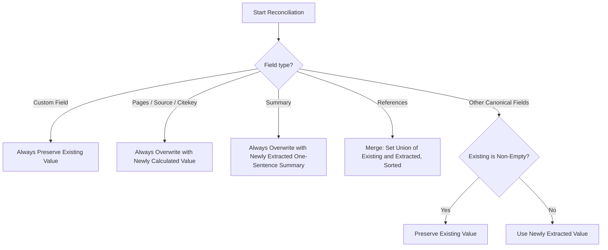

# Phase 1 Data Model: Resume-Safe Metadata and Prompt Isolation

This document defines the schemas, data models, and fields for metadata processing and reconciliation.

## 1. Production LLM Metadata Schema (MetadataSchema)

The Pydantic model `MetadataSchema` used for LLM structured extraction is updated to remove legacy/obsolete fields. It now contains only raw document fields needed to construct frontmatter, the Metadata table, and citation callouts.

### Fields to Remove (Obsolete)
- `mentioned_states`
- `mentioned_organisations`
- `mentioned_cities`
- `tags`

*Note: Entity, topic, and conceptual tag extraction are handled exclusively by the tagging path.*

### Schema Fields
| Field Name | Type | Description / Validation |
|---|---|---|
| `title` | `str` | Title of the document. Extracted in its original language, natural casing, no ALL CAPS. |
| `summary` | `str` | Exactly one sentence summary. Independent entity. |
| `abstract` | `str` | Detailed overview (up to 20 sentences). Rendered ONLY in Abstract callout. |
| `author_name` | `str` | Name of the author. |
| `author_institution` | `str` | Responsible organization. |
| `date` | `str` | Complete official document date (YYYY-MM-DD). |
| `archive_code` | `str` | Archival reference code (e.g., `NPG/D(77)12`). |
| `language` | `str` | Primary language. |
| `location_city` | `str` | Origin city. |
| `location_state` | `str` | Origin nation-state. |
| `sender` | `str` | Correspondence sender name/institution. |
| `recipient` | `str` | Correspondence recipient name/institution. |
| `intent` | `str` | Purpose or request of correspondence. |
| `references` | `list[str]` | List of other archival codes mentioned (e.g., `["C-M(55)15"]`). |

---

## 2. Reconciled Metadata Model (Code-Level)

The reconciled metadata model represents the unified metadata output. It is used to generate YAML frontmatter and the rendered Metadata table.

### Canonical Frontmatter & Table Fields
The model contains the following fields:
1. `title`
2. `summary` (exactly one sentence)
3. `pages` (code-derived, integer/string representation of total page count)
4. `source` (code-derived, Obsidian-style link to the source PDF)
5. `sender`
6. `recipient`
7. `intent`
8. `author_name`
9. `author_institution`
10. `date`
11. `archive_code`
12. `citekey` (code-derived, normalized BibTeX key)
13. `language`
14. `location_city`
15. `location_state`
16. `references` (stored as list of strings in frontmatter, formatted in the table)
17. *Custom Fields* (user-supplied custom keys in existing frontmatter, preserved deterministically)

---

## 3. Metadata Reconciliation Rules

When updating a file's metadata, existing user-supplied frontmatter is reconciled with the newly extracted/calculated metadata using the following deterministic rules:

### Table of Rules
| Field | Source / Reconciliation Rule |
|---|---|
| `title` | Preserve existing if non-empty; else use newly extracted. |
| `summary` | Always overwrite with newly extracted (enforces one-sentence constraint). |
| `pages` | Always overwrite with newly calculated page count. |
| `source` | Always overwrite with newly calculated PDF link. |
| `sender` | Preserve existing if non-empty; else use newly extracted. |
| `recipient` | Preserve existing if non-empty; else use newly extracted. |
| `intent` | Preserve existing if non-empty; else use newly extracted. |
| `author_name` | Preserve existing if non-empty; else use newly extracted. |
| `author_institution` | Preserve existing if non-empty; else use newly extracted. |
| `date` | Preserve existing if non-empty and valid; else use newly extracted. |
| `archive_code` | Preserve existing if non-empty; else use newly extracted. |
| `citekey` | Always overwrite with newly calculated deterministic citekey. |
| `language` | Preserve existing if non-empty; else use newly extracted. |
| `location_city` | Preserve existing if non-empty; else use newly extracted. |
| `location_state` | Preserve existing if non-empty; else use newly extracted. |
| `references` | Sorted list union of existing references and newly extracted references. |
| *Custom fields* | Always preserved as-is. |
